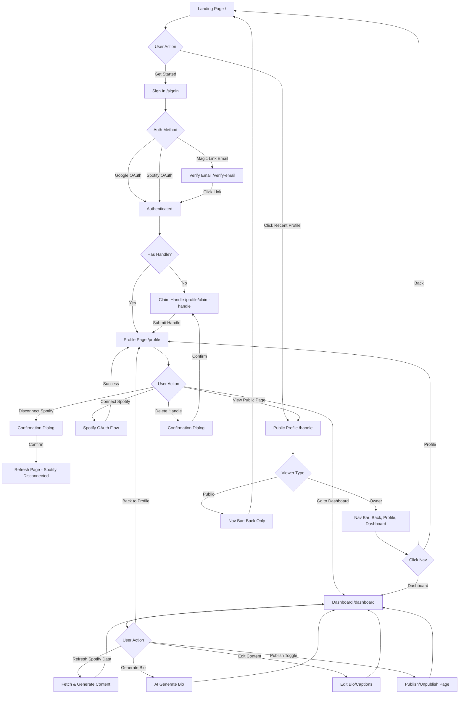
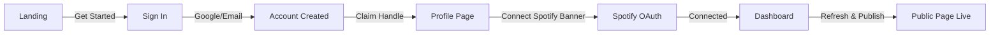

# Anchor.band Navigation Flow

## Current Flow Diagram



## Authentication Architecture

### Current: Dual Authentication System

**Account Identity (NextAuth)**
- Google OAuth
- Magic Link Email
- ~~Spotify OAuth~~ (on sign-in page)

**Data Source (Spotify)**
- Spotify OAuth (connect on profile page)
- Tokens stored encrypted in DynamoDB
- Can disconnect/reconnect independently

### Your Question: Do We Need Separate Auth?

**Arguments for keeping separate auth:**

1. **Separation of Concerns**
   - Account identity ≠ Data source
   - User owns their handle/account regardless of Spotify connection
   - Can disconnect Spotify without losing account

2. **User Flexibility**
   - Not everyone has Spotify (or Premium)
   - Users can claim handle before connecting music service
   - Future: Could add Apple Music, Last.fm, YouTube Music

3. **Security**
   - Spotify tokens expire and can be revoked
   - Don't want users to lose account access if Spotify disconnects
   - Account is permanent, data source is temporary

4. **Handle Claiming**
   - Users might want to reserve their handle before setting up Spotify
   - Handle is tied to account, not music service

**Arguments for Spotify-only auth:**

1. **Simplicity**
   - One OAuth flow instead of two
   - Less confusion about "sign in" vs "connect"
   - Fewer steps to get started

2. **Core Value Alignment**
   - App is fundamentally about Spotify music data
   - No Spotify = no content to display
   - Why have an account without the core feature?

## Recommendation

### Option A: Remove Spotify from Sign-In Page (Recommended)

**Current Problem:** Having Spotify on the sign-in page is confusing
- Users don't know if it's for account creation or just data access
- Creates expectation that Spotify = full login
- Two-step process (sign in → connect Spotify) is clearer

**Proposed Change:**
```
Sign In Page:
- Google OAuth (primary social)
- Magic Link Email (passwordless)
- Remove Spotify OAuth

Profile Page:
- Clear "Connect Spotify" button after sign-in
- Explains: "Connect to fetch your music data"
```

**Flow:**
1. Sign in with Google/Email → Creates account + claims handle
2. Profile page → "Connect Spotify to get started" banner
3. Connect Spotify → Dashboard with music data
4. Can disconnect Spotify later without losing account

### Option B: Spotify-Only Auth (Simpler but less flexible)

**Change everything to Spotify:**
```
Sign In Page:
- "Sign in with Spotify" (only option)

After Spotify OAuth:
- Account created automatically
- Claim handle
- Music data already connected
```

**Pros:**
- One OAuth flow
- Simpler for users
- Music data connected immediately

**Cons:**
- Users without Spotify Premium? (need to check API limits)
- Can't disconnect Spotify without losing account
- Less future-proof for other music services
- Spotify token issues = account access issues

## My Recommendation

**Remove Spotify from the sign-in page, keep it as a connection step on the profile page.**

This gives you:
- ✅ Clear separation: Account creation (Google/Email) vs. Data connection (Spotify)
- ✅ Flexibility: Users can disconnect/reconnect Spotify freely
- ✅ Future-proof: Easy to add other music services later
- ✅ Better UX: Clear two-step process instead of confusion about what Spotify does
- ✅ Account security: Account identity separate from data source tokens

The current confusion is that Spotify appears on sign-in but doesn't give you a full experience - you still need to connect it again on the profile page (allowDangerousEmailAccountLinking makes it work, but it's unclear to users).

## User Journey After Change



Clear, linear, understandable.

What do you think?
